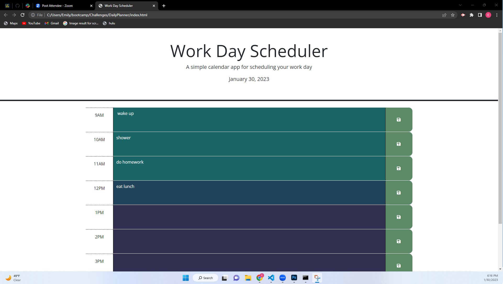

# DailyPlanner

## Description

This project is used to add tasks to a 9-5 planner daily. This can be valuable to someone with a hectic or busy day. There is a live date stamp at the top of the screen and to keep with what hour it is. the hour blocks will change when they are either past, present or future. 

## Installation

N/A

## Usage

This planner can be used to add tasks by the hour for a 9-5 day. These tasks can be saved and viewed later, since they will be saved into the local storage. Any task can also be removed or written over if it is saved again. 

## Credits

N/A

## License

MIT

